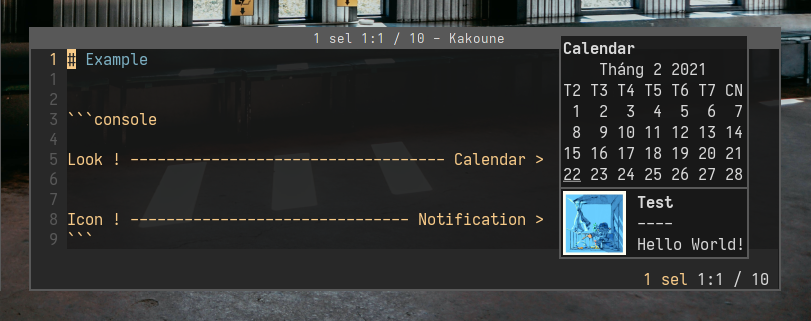
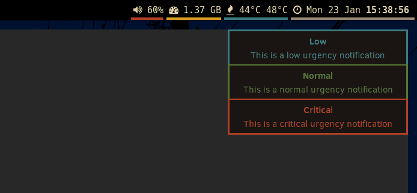
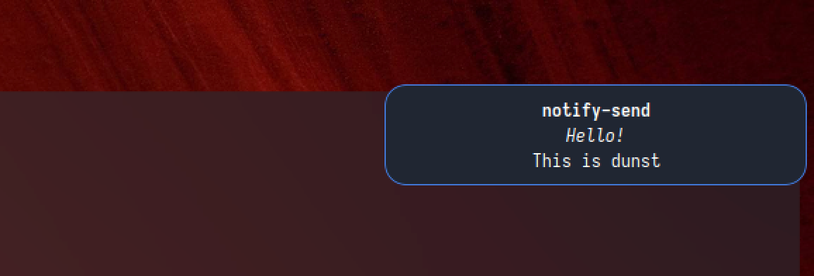

[](https://github.com/dunst-project/dunst/actions?query=workflow%3Amain) [](https://codecov.io/gh/dunst-project/dunst)

# Dunst

<i>A highly configurable and lightweight notification daemon.</i>


## Table of Contents

* [Features](#features)
* [Building](#building)
* [Contributing](#contributing)
* [Documentation](#documentation)
* [Troubleshooting](#troubleshooting)
* [Copyright](#copyright)

# Features

## ⚙️ Highly customizable

Customize fonts, icons, timeouts, and more. Are you unhappy with the default
shortcuts and colors? No worries, you can change these all with a simple
configuration file tweak.

_click the images to see the dunstrc_

<a href="https://gist.github.com/NNBnh/5f6e601a6a82a6ed43b1959698758141">

</a>

<a href="https://gist.github.com/fwSmit/9127d988b07bcec9d869f2c927d0f616">

</a>

## 📜 Scripting

<a href="https://gitlab.manjaro.org/profiles-and-settings/manjaro-theme-settings/-/blob/master/skel/.config/dunst/dunstrc">

</a>

Run custom scripts on notifications matching a specified pattern. Have espeak
read out your notifications, or play a song when your significant other signs on
in pidgin!

## 📋 Rules

Change the look or behavior of notifications matching a specified pattern. You
could use this to change the color of message notifications from your favorite
jabber buddies, or to prevent important work email notifications from
disappearing until you manually dismiss them.

## ⏸️ Pause

If you want to take a break and not receive any notifications for a while, just
pause dunst. All notifications will be saved for you to catch up
later.

## 🕘 History

Catch an unread notification disappearing from the corner of your eye? Just tap
a keyboard shortcut to replay the last notification, or continue tapping to see
your notification history.

# Documentation

Most documentation can be found in dunst's man pages. In
[**dunst(1)**](docs/dunst.1.pod) contains some general instructions on how
to run dunst and in
[**dunst(5)**](docs/dunst.5.pod) all of dunst's configuration options are
explained.

On the dunst [wiki][wiki] you can find guides and installation instructions and
on the dunst [website][website] there is a [FAQ][FAQ] with common issues.

## Installation

Dunst is available in many package repositories. If it's not available in your
distro's repositories, don't worry, it's not hard to build it yourself.

### Dependencies

- dbus (runtime)
- libxinerama
- libxrandr
- libxss
- glib
- pango/cairo
- libnotify (can build without, for dunstify, see [make parameters](#make-parameters))
- wayland-client (can build without, see [make parameters](#make-parameters))
- wayland-protocols (optional, for recompiling protocols)
- xdg-utils (optional, xdg-open is the default 'browser' for opening URLs)

The names will be different depending on your [distribution](https://github.com/dunst-project/dunst/wiki/Dependencies).

### Building

```
git clone https://github.com/dunst-project/dunst.git
cd dunst
make
sudo make install
```

### Make parameters

- `DESTDIR=<PATH>`: Set the destination directory of the installation. (Default: `/`)
- `PREFIX=<PATH>`: Set the prefix of the installation. (Default: `/usr/local`)
- `BINDIR=<PATH>`: Set the `dunst` executable's path (Default: `${PREFIX}/bin`)
- `DATADIR=<PATH>`: Set the path for shared files. (Default: `${PREFIX}/share`)
- `SYSCONFDIR=<PATH>`: Set the base directory for system config files. (Default: `${PREFIX}/etc/xdg`)
- `SYSCONFFILE=<PATH>`: Set the absolute path to which the default dunstrc shall be installed. (Default: `${SYSCONFDIR}/dunst/dunstrc`)
- `SYSCONF_FORCE_NEW=(0|1)`: Overwrite existing `${SYSCONFFILE}`. (Default: 0 (don't overwrite))
- `MANDIR=<PATH>`: Set the prefix of the manpage. (Default: `${DATADIR}/man`)
- `SYSTEMD=(0|1)`: Disable/Enable the systemd unit. (Default: autodetect systemd)
- `WAYLAND=(0|1)`: Disable/Enable wayland support. (Default: 1 (enabled))
- `DUNSTIFY=(0|1)`: Disable/Enable the libnotify dunstctl utility. (Default: 1 (enabled))
- `SERVICEDIR_SYSTEMD=<PATH>`: The path to put the systemd user service file. Unused, if `SYSTEMD=0`. (Default: `${PREFIX}/lib/systemd/user`)
- `SERVICEDIR_DBUS=<PATH>`: The path to put the dbus service file. (Default: `${DATADIR}/dbus-1/services`)
- `EXTRA_CFLAGS=<FLAGS>`: Additional flags for the compiler.

**Make sure to run all make calls with the same parameter set. So when building with `make PREFIX=/usr`, you have to install it with `make PREFIX=/usr install`, too.**

**Notes on default of XDG_CONFIG_DIRS**

Dunst uses a different default (${SYSCONFDIR}) for XDG_CONFIG_DIRS at runtime.
This is a slight digression from the recommended value in the XDG Base Directory
Specification (/etc/xdg), because the default config file gets installed to
${SYSCONFDIR/dunst/dunstrc} to avoid conflicts with /etc/xdg/dunst/dunstrc which
might have been installed from a distribution repository. If you do want dunst
to use the spec's recommended default, set XDG_CONFIG_DIR=/etc/xdg at runtime or
SYSCONFDIR=/etc/xdg at compile time.

**Notes on SYSCONFFILE**

Changing SYSCONFFILE does not affect the search for config files, meaning it
will not take effect if you choose to install dunstrc to a location that cannot
be found by the algorithm outlined in the FILES section of dunst(1).

`make install` will not overwrite an already existing ${SYSCONFFILE} (i.e.
/usr/local/etc/xdg/dunst/dunstrc), see SYSCONF_FORCE_NEW above. This is so you
do not lose local changes to said file on upgrade. However, it is recommended
to leave that file untouched and use a more important config location to
override settings, see the FILES section in dunst(1) for more details.

`make uninstall` will not remove ${SYSCONFFILE}, use `make uninstall-purge` if
you do want it removed as well.

## Contributing

Contributions are very welcome. Before contributing, make sure to look at the
contribution documentation in [HACKING.md](./HACKING.md).

Make sure you test your code and where possible add automated tests. These
tests are also checked on memory leaks (with `make test-valgrind`).

## Troubleshooting

### Cannot set settings via command line

This functionality was removed during the refactor. It might be re-added later
in some form. See [#940](https://github.com/dunst-project/dunst/issues/940) for
details.

## Bug reports

Please use the [issue tracker][issue-tracker] provided by GitHub to send us bug reports or feature requests.

## Screenshots

<a href="https://gist.github.com/MCotocel/2b34486ae59ccda4319fcb93454d212c">

</a>

<a href="https://gitlab.manjaro.org/profiles-and-settings/manjaro-theme-settings/-/blob/master/skel/.config/dunst/dunstrc">

</a>

## Maintainers

- [Friso Smit](https://github.com/fwsmit) <fw.smit01@gmail.com>
- [Nikos Tsipinakis](https://github.com/tsipinakis) <nikos@tsipinakis.com>
- [Benedikt Heine](https://github.com/bebehei) <bebe@bebehei.de>

## Author

Written by Sascha Kruse <dunst@knopwob.de>

## Copyright

Copyright 2013 Sascha Kruse and contributors (see [`LICENSE`](./LICENSE) for licensing information)

[issue-tracker]:  https://github.com/dunst-project/dunst/issues
[wiki]: https://github.com/dunst-project/dunst/wiki
[website]: https://dunst-project.org
[FAQ]: https://dunst-project.org/faq
